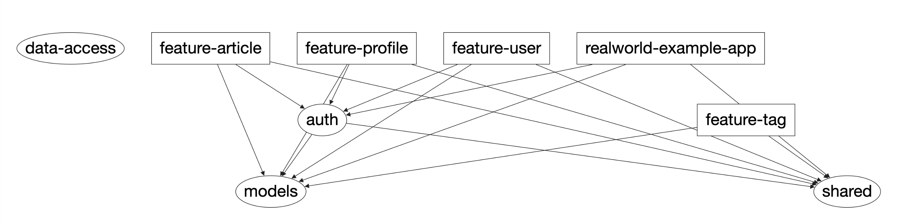

# Microservices Realworld Example App

## A [realworld app](https://github.com/gothinkster/realworld) micro-services implementation, using the following tech stack:
- [NX.dev](https://nx.dev/latest/node/getting-started/getting-started) Monorepo
- [Nest.js](https://docs.nestjs.com/) for BE services
- [Mongoose](https://mongoosejs.com/) using `@nestjs/mongoose` module for persistence
- [GraphQL](https://www.apollographql.com/) using `@nestjs/graphql` module for gateway GraphQL API
- Auth with [passport-jwt](http://www.passportjs.org/packages/passport-jwt/) using `@nestjs/jwt` and `@nestjs/passport` modules
- Global config using `@nestjs/config` module
- Swagger OpenAPI route documentation using `@nestjs/swagger` module
- TypeScript
- MongoDB - for service persistence layer running in a docker container
- Redis - Queue implementation over Bull and Redis as a service message bus using `@nestjs/bull`

## Application Bootstrap

* Run `docker-compose up -d`
* Create the mongo db:
SSH into the mongo container:
```
docker exec -it realworld-mongo sh
```
Once SSHed into it:
```
mongo
use realworld
quit()
```
* Change `.env` file values if required.
* Run all services using `yarn start:all`
* Use PostMan exported collection `realworld.postman_collection.json` for calling APIs


## The feature micro services are:
* `feature-user` is responsible for `/api/user` functionality and endpoints.
* `feature-tag` is responsible for `/api/tags` functionality and endpoints.
* `feature-profile` is responsible for `/api/profie` functionality and endpoints.
* `feature-article` is responsible for `/api/articles` functionality and endpoints.

All feature services expose OpenApi Swagger definitions under `/api` route.

## The GraphQL Gateway
* `realworld-examples-app` is the GraphQL gateway for the above services. Code-First GraphQL autogenerated schema is saved under `apps/realworld-example-app/schema.graphql`.

The playground is accessible via `localhost:3330/graphql`.

For example, getting the current logged-in user details, along with her feed and the list of articles she wrote (with comments for each article returned in feed/articles if they exist):
```
fragment userFragment on User {
  _id
  email
  username
}

fragment articleFragment on Article {
  _id
  body
  description
  favoritesCount
  tagList
  title
  comments {
    _id
    body
    author {
      ...userFragment
    }
  }
  author {
    ...userFragment
  }
}

query {
  me {
    ...userFragment
    feed {
      ...articleFragment
    }
    articles {
      ...articleFragment
    }
  }
}
```

For using the GraphQL gateway with authenticaed routes:
* First call the login mutation with `username` (email) and `password` -> get the `access_token`.
* Add `{"token": <JWT token>}` to the headers.

See `data-access` lib for predefined Queries, Mutations and Fragments and their respective autogenerated Types and React hooks.

## The libs
Feature services and the GraphQL gateway use the following libs:
* `auth` is responsible for user login and issueing the JWT token, as well as exporting the `JwtAuthGuard` used on protected routes in all feature services.
* `models` exposes DTOs and ENUMs used by feature services.
* `shared` exposes reusable services used by feature services.
* `data-access` exposes auto-generated types and react hooks based on schema types and queries/mutations. Generated code is the result of running `yarn codegen` or `yarn codegen:watch`. Codegen config is `codegen.yaml`.

## Apps and Libs dependency graph



## Micro services message bus
We use Redis as the queue persistence layer and [Bull](https://optimalbits.github.io/bull/) & `@nestjs/bull` for the queue implementation.

The purpose of this is for feature services to be able to notify something happened in the system, and other feature services can react and complete the flow.

One flow that uses this is:
  - User creates an article, with `tagList` that includes some new tags and some existing tags
  - `feature-article` service publishes a message with the `tagList` on the `EvaluateTags` topic to the `Tags` queue and saves the new article.
  - `feature-tag` implements a consumer that processes messages under the `EvaluateTags` topic on the `Tags` queue and creates the new tags in DB.

Another exaple is:
  - User is created or updated
  - `feature-user` service publishes `userUpdated` event on the `Users` queue and saves the new/updated user.
  - `feature-profile` services implements a `UserConsumer` consumer that processes messages under `userUpdated` topic on the `Users` queue and creates/updates the relevant profile in DB.

See Real World App [spec here](https://github.com/gothinkster/realworld/tree/master/api).
